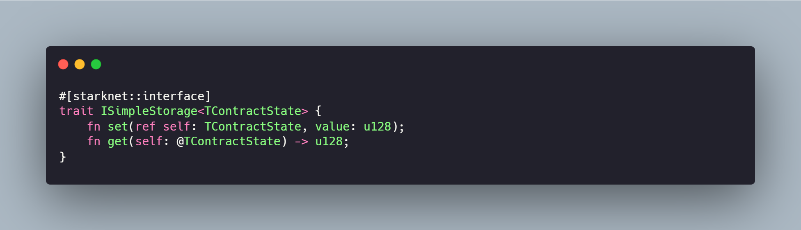
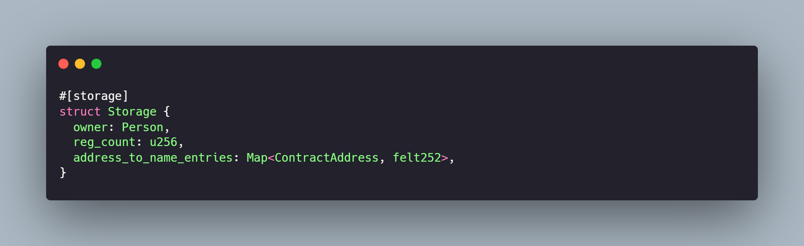
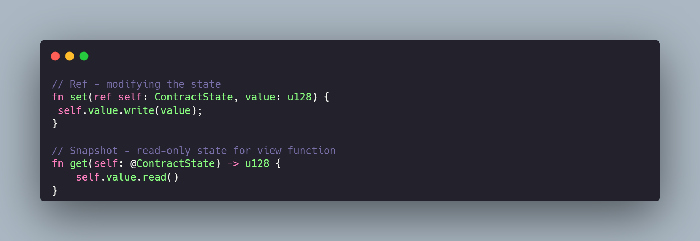
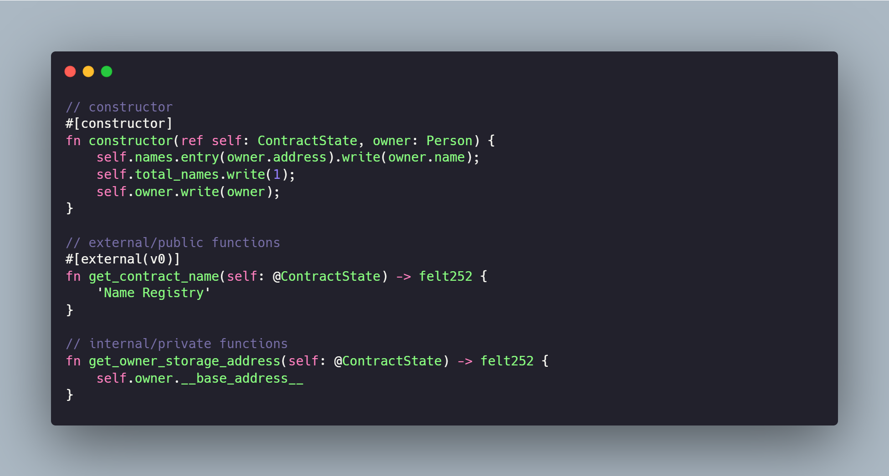
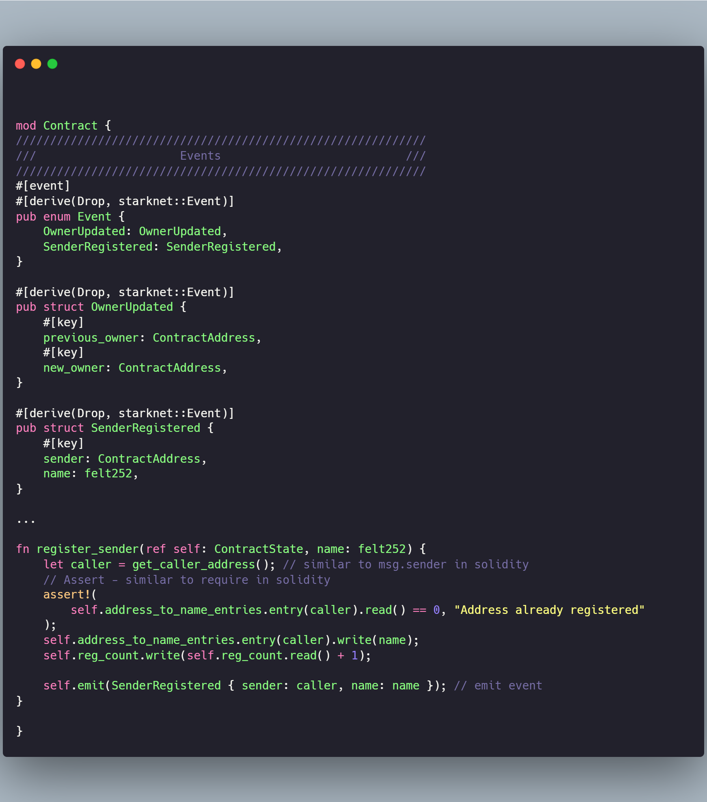

## 1. Anatomy of the Cairo Contracts
- Each cairo contract needs to have an interface/blueprint of the contract defined beforehand, it defines the functions in advance that will be known to the outside world. The interface is defined by annotating a trait with #[starknet::interface]

This can be overcome by simply using #[generate_trait], which tells the compiler to generate the corresponding trait definiition.

All the functions of the trait are considered as public that are callable from outside world.

NOTE: constructor and internal functions are not a part of the trait/interface.

All the contract interfces use a generic type of self parameter that represents the generic contract state denoted by TContractState (can be named anything).

## 2. Storage
- The storage struct is a struct like any other, except that it must be annotated with the #[storage] attribut
  
Reading from and writing to storage state. To read the storage value we call the read() function and write() to modify the storage.

For more advanced storage layout refer to : https://book.cairo-lang.org/ch14-01-00-contract-storage.html#storing-custom-types-with-the-store-trait

## 3. Functions
- 3.1 Before diving into functions, it's important to understand the snapshots and references.
  - A snapshot is an immutable view of a value at a certain point in time. Snapshots are defined using @, when self is a snapshot of ContractState, only read access is allowed. Any function that defines the state with a snapshot is treated as view function.
  - A reference type of ContractState on the other hand implies that the state may be modified by the function

  

- 3.2 Visibility of the functions:
  - 3.2.1 External/public functions:
  - The functions that are annotaed with #[abi(embed_v0)] or #[external(v0)] are treated as external functions.
  - 3.2.2 Internal/Private - On the other hand the functions or the group not marked with any of the abi-embed or external annotations are treated as internal/private by default
  - NOTE: it is important to note that internal and private are used interchangably in cairo. Refer to more advanced annotations here: https://book.cairo-lang.org/ch14-02-contract-functions.html#abiper_item-attribute
  
  

## 4. Events and Errors

- 4.1 An event is defined by declaring an Enum first and then adding all the events and their corresponding types to that enum. Also the enum must be annotated with #[derive(starknet::Event)]

Event data can be annotated by #[key] to filter the data on explorer, similar to indexed in solidity

Another annotation besides key is #[flat], which essentially flattens the complex types for example nested enums.

Events are emittted using self.emit(EventName)

